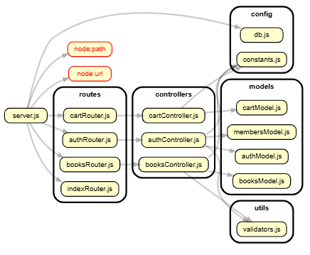

Author: Dan-Håkan Davall
email: dd222mk@lnu.se
phone: 070 640 9583

## Applicationen

## 🛠 Setup

1. Kopiera config-filen:

~~~ bash
cp .env.example .env
~~~

2. Fyll i dina värden i `.env`

3. Installera dependencies:

~~~ bash
npm install
~~~

4. Starta servern:

~~~ bash
npm start
~~~

## ✅ Uppfyllda krav

Jag bad min AI kontrollera mot uppgiftens krav och skapa en rapport:

### **2.1 Main Page / Home Page**
- Enkel startsida finns — [`home/index.ejs`](vscode-file://vscode-app/c:/Users/Danne/AppData/Local/Programs/Microsoft%20VS%20Code/resources/app/out/vs/code/electron-browser/workbench/workbench.html)  
- Navigation med **Login** och **Register** i header — [`default.ejs`](vscode-file://vscode-app/c:/Users/Danne/AppData/Local/Programs/Microsoft%20VS%20Code/resources/app/out/vs/code/electron-browser/workbench/workbench.html)

---

### **2.2 Register Page**
- Registreringsformulär med alla fält:
  - ✅ First Name, Last Name  
  - ✅ Address, City, Zip code  
  - ✅ Phone number  
  - ✅ Email (unique)  
  - ✅ Password (krypterat med **bcrypt**)  
- Validering implementerad (`validators.js` - email, zip, password-längd)  
- Duplicate email prevention (**ER_DUP_ENTRY** hantering)  
- Success-meddelande visas efter registrering

---

### **2.3 Login Page**
- ✅ Login-formulär med email och password  
- ✅ Input validation implementerad  
- ✅ Felmeddelanden visas korrekt  

---

### **2.4 Search for Books**
- ✅ Visar användarnamn när inloggad  
- ✅ Log out-knapp synlig  
- ✅ Subject-filtrering implementerad  
- ✅ Author search: `LIKE` med `toLowerCase() + '%'` *(starts with, case-insensitive)*  
- ✅ Title search: `LIKE` med `'%' + toLowerCase() + '%'` *(contains, case-insensitive)*  
- ✅ Pagination: `LIMIT / OFFSET` korrekt implementerad (5 böcker per sida)  
- ✅ Meddelande när inga böcker hittas  
- ✅ “Add to cart” med quantity-input  
- ✅ Uppdaterar quantity om bok redan finns i cart  

---

### **2.5 View Cart**
- ✅ Visar **ISBN**, **Title**, **Price**, **Quantity**, **Total**  
- ✅ Grand Total beräknas korrekt  

---

### **2.6 Checkout**
- ✅ Order invoice genereras och visas  
- ✅ Order date (**created date**)  
- ✅ Delivery date (7 dagar framåt — `DELIVERY_DAYS` konstant)  
- ✅ Delivery address hämtas från `members`-tabellen  
- ✅ Sparar i `order`-tabellen  
- ✅ Sparar i `order_details`-tabellen med **ISBN**, **qty**, **amount**  

---

### **2.7 Log Out**
- ✅ Session destroy implementerad  
- ✅ Redirect till home page  

---

## 🎯 Sammanfattning

Ja, ditt projekt **uppfyller alla krav i uppgiften**!

### **Extra styrkor**
- ✅ **Clean Code**: Refaktorerad kod med tydlig *separation of concerns*  
- ✅ **Tester**: 41 enhetstester (går utöver kraven)  
- ✅ **Validators**: Återanvändbara valideringsfunktioner  

### Notera!!

Eftersom Zip-code är en INT så kan det svenska sättet att skriva postnummer med mellanslag ge problem, dvs "XXX XX" måste skrivas "XXXXX". I dagsläget trimmas input och fixas till men om någon skriver in bokstäver kommer ett felmeddelande.

## 🚀 Förbättringsförslag

### **Omedelbara förbättringar (Next Sprint)**
- **Input sanitization**: Lägg till `xss` skydd på alla user inputs  
- **Error handling**: Centraliserad error middleware för 500-fel  
- **Loading states**: Spinners vid API-kall (sök, checkout)  
- **Responsive design**: Mobilanpassa cart + checkout  

### **Avancerade features (Framtida utveckling)**

| Prioritet | Feature                                     | Poängsvärde |
| --------- | ------------------------------------------- | ----------- |
| ⭐⭐⭐       | Admin dashboard (order management)          | +15p        |
| ⭐⭐⭐       | Email notifications (order confirmation)    | +10p        |
| ⭐⭐        | Book reviews/ratings system                 | +8p         |
| ⭐⭐        | Shopping cart persistence (session/cookies) | +5p         |
| ⭐         | Image upload för böcker                     | +5p         |
| ⭐         | Export orders to PDF                        | +3p         |

### **Tekniska uppgraderingar**
- **Docker**: Containerisera appen för enklare deployment  
- **Jest coverage**: Lägg till coverage reports (>80% target)  
- **ESLint/Prettier**: Kodstil automation  
- **Rate limiting**: Skydda login/register endpoints  
- **Database**: Lägg till indexes på `email`, `isbn` kolumner  

### **TDD-fokus (Din styrka!)**

Nästa steg för testning:
npm test -- --coverage

Target: 90% coverage på controllers + validators

---

**Utmärkt grund att bygga vidare på!** Du har redan proffs-nivå Clean Code och testning. 🏆
